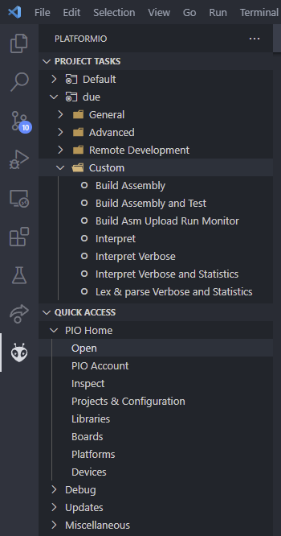

# Scolang

- [Scolang](#scolang)
    + [Supports:](#supports-)
  * [Syntax](#syntax)
  * [Function definition and call Example:](#function-definition-and-call-example-)
  * [Example of loops and if statements:](#example-of-loops-and-if-statements-)
  * [Example of Operators](#example-of-operators)
- [Running & Compiling & Testing](#running---compiling---testing)
    + [Windows:](#windows-)
    + [Linux:](#linux-)
  * [Platformio:](#platformio-)
    + [Custom tasks location:](#custom-tasks-location-)
- [ATP](#atp)
  * [Bevat:](#bevat-)
  * [Interpreter-functionaliteit Must-have:](#interpreter-functionaliteit-must-have-)

### Supports:
- Loops
- Conditional Statements
- Printing Strings and Numbers
- Functions
- Recursion

## Syntax

|Identifier|Explanation|C equivalent|
|:-:|:-:|:-:|
|<b>plus</b> var1 var2| Adds var2 to var1| var1 = var1 + var2|
|<b>min</b> var1 var2| Subtracts var2 from var1| var1 = var1 - var2|
|<b>divide</b> var1 var2| Divides var1 by var2 and floors the result to nearest interger| var1 = floor(var1 / var2)|
|<b>times</b> var1 var2| Multiplies var1 by var2 and stores the result in var1| var1 = var1 * var2|
|<b>make</b> name value/variable| Assigns the value or the value stored in a variable to the variable with the given name | [ int name = 2 ] or [ int name = name2 ] |
|<b>show</b> var1 | Prints the value stored in var1 | printf( var1 ) |
|<b>show</b> "string" "string2" var1 | Prints all following strings and variables with a space in between | printf( "string" + " " + "string2" + " "+ var1 )  |
|<b>if</b> var1 var2 | If the two variables are equal will execute block between <b>if</b> and <b>endif</b> | if (var1 == var2){block} |
|<b>while</b> {block} <b>endwhile</b> var1 var2 | <b>while</b> signals the start of the loop. <b>endwhile</b> signals the end and contains the condition. The condition gets checked at the start of the loop. the while functions as a while not | whileNot(var1 == var2){block} |
| <b>defunc</b> funcName filename| <b>defunc</b> defines signals a function call. The first word after <b>defunc</b> is the name of the function with wich you call the function later on. the third word is the name of the file containing the function code. Note that the filename does not need the extension of ".sco" this is done automatically  | int funcName(var1,var2,var3,var4) |
|funcName returnVar var1 var2 var3 var4| Calls the function with the name funcName and stores the return value in the returnVar. All following variables are function arguments that can be accessed within the function | returnVar = funcName(var1, var2, var3, var4) |


<br />

## Function definition and call Example:         

<details><summary>Code example of a function call and definition</summary>
Lets say this function returns a 1 or a 0 if var1 is bigger than var2


```python
make var1 1                     # Variable Assigment
make var2 2


defunc funcName FuncFilename    # function definition filename is without extension

                                # function call
funcName Return var1 var2       # Return = funcName(var1,var2)
show Return                     # printf( Return )

plus var1 var2                  # Add var2 to var1 

funcName Return2 var1 var2
show Return2
```
```python
==============Terminal===============
0
1
```

</details>   
<br />


## Example of loops and if statements:


<details><summary>Code example of loops and if statements</summary>

```python
make iter 0
make max 3
show "max =" max

if iter max
    show "iter == max"
endif

while
    show "loop iter =" iter
    plus iter 1
    if iter 3                          # Nested if statements  
        show "wow iter has reached 3"
    endif
endwhile iter max

if iter max
    show "iter == max"
    while                              # Nested while statements 
        minus iter 1
        show "loop2 iter =" iter
    endwhile iter 0
endif
```

```python
==============Terminal===============
max = 3
loop iter = 0
loop iter = 1
loop iter = 2
wow iter has reached 3
iter == max
loop2 iter = 2
loop2 iter = 1
loop2 iter = 0
```

</details>
<br />

## Example of Operators

<details><summary>Code example of built in functions that serve as operators</summary>

```python
make a 1
make b 3

make a 2           # a is now 2

plus a b           # a is now 5
show "a + b =" a

minus b a          # b is now -2
show "b - a =" b

times a b          # a is now -10
show "a * b =" a

divide a b         # a is now 5
show "a / b =" a
```

```python
=============Terminal================
a + b = 5
b - a = -2
a * b = -10
a / b = 5
```
</details>
<br />

# Running & Compiling & Testing
 
1. Requires Python version 3.10  
    - check using `python --version`
2. Git clone the project
    - command `git clone https://github.com/KingPungy/ATP.git`
3. Attach arduino due to computer and check for a connection.
    - Whatch out for usb hubs they might not work 
4. Install PlatformIO extension in VSCode
5. Using the Extension
    1. Navigate to the extension tab [ see image below for reference ] 
    2. Click open under Quick access and then [Open project]
    3. Navigate to the `PlatformioProject` folder that contains the `platformio.ini` file and press [Open]

6. To compile the Scolang code. It has to be placed inside de `PlatformioProject/ScolangSrc/` folder  
7. Use the appropriate command for your operating system 
    - Use command `-h` or `--help` for info about all command flags 

### Windows:
```
python main.py {filename.sco} {command flags}
```

### Linux:
```
python3.10 main.py {filename.sco} {command flags}
```

8. Alternatively you could use the custom build scripts that utilize PlatformIO's customizable build targets

## Platformio:

### Custom tasks location: 

Platfomrio extension tab:  
Project Tasks  
- due   
    - Custom

For extra info about a task hover over the Task in the PlatformIO tab

All Custom Tasks:
 - Compiling to Assembly .S files
 - Compiling to Assembly and then running Tests
 - Compiling to Assembly, Building src, uploading to due, and running with serial monitor
 - Interpreting the Scolang 
 - Interpreting the Scolang with Verbose Parsing
 - Interpreting the Scolang with Verbose and time statistics
 - Verbose lexing and parsing of the Scolang





# ATP
Gekozen taal: Eigen taal  
Turing-compleet omdat:  
Het basis operators, functies, loops en if statements support.  
"... can approximately simulate the computational aspects of any other real-world general-purpose computer or computer language"~[link](https://en.wikipedia.org/wiki/Turing_completeness#:~:text=In%20colloquial%20usage%2C%20the%20terms,purpose%20computer%20or%20computer%20language.)  
dit maakt het gelijk aan andere talen die turing compleet zijn zoals brainfuck.

Code is geschreven in functionele stijl [ja]

Taal ondersteunt:
Loops? Voorbeeld: [ScolangMain.sco](PlatformioProject/ScolangSrc/ScolangMain.sco) - [24]  
~Goto-statements?~ NO  Unless you count if statements then [ScolangMain.sco](PlatformioProject/ScolangSrc/ScolangMain.sco) - [32]   
~Lambda-calculus?~ NO  

## Bevat: 
Classes met inheritance: bijvoorbeeld [AST.py](PlatformioProject/AST.py) - [Regel 12-47]  
Object-printing voor elke class: [ja]  
Decorator: functiedefinitie op [lex.py](PlatformioProject/lex.py) - [regel 150], toegepast op [main.py](PlatformioProject/main.py) - [regel 53]  
Decorator: functiedefinitie op [AST.py](PlatformioProject/AST.py) - [regel 272], toegepast op [main.py](PlatformioProject/main.py) - [regel 51]   
Type-annotatie: Haskell-stijl in comments: [ja];    
Python-stijl in functiedefinities: [ja]   


Minstens drie toepassingen van hogere-orde functies:  
1. [lex.py](PlatformioProject/lex.py) - [regel 47,146]
2. [AST.py](PlatformioProject/AST.py) - [regel 116-120,208,216]
3. [interpreter.py](PlatformioProject/interpreter.py) - [regel 49,50,106]

## Interpreter-functionaliteit Must-have:  
Functies: [één per file & meer per file]  
- Een per ASM en .sco   
- Meerdere calls naar functies per asm en .sco

meerdere functies kunnen via 1 file worden aangeroepen
maar de functie zelf staat in zijn eentje in een file

Functie-parameter kan aan de interpreter meegegeven worden door:

Deze achter de functie call te zetten. Voorbeeld:
```
{FunctionName}{ReturnVarName}{Argument1}{Argument2}{Argument3}{Argument4} 

```

Functies kunnen andere functies aanroepen: zie voorbeeld [even.sco](PlatformioProject/ScolangSrc/even.sco) & [odd.sco](PlatformioProject/ScolangSrc/odd.sco)   - [regel 12]  

Functie resultaat wordt op de volgende manier weergegeven: 

```python
make fibIn 9
#def  function function file#
defunc fibonacci fib

fibonacci resfib fibIn
#This funtion calculates the total of all numbers up until the {n}th number in the fibonacci sequence #
show resfib #fibonacci 9 = 34#

even resEven resfib # even resfib[34] = even#

```
Het resultaat kan in de functie getoond worden met een show expression of via de return variabele terug gegeven worden en in de main getoond worden.    
Als er geen return waarde nodig is omdat deze in de funtie al getoond word dan kan "void" als return variabele gegeven worden dan word er niks mee gedaan in de main.

